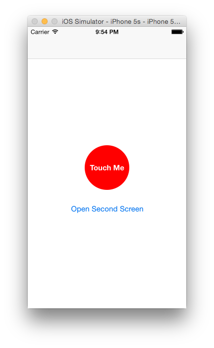
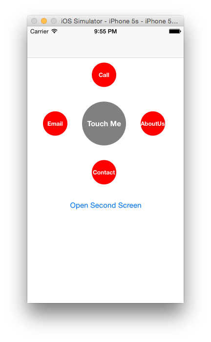
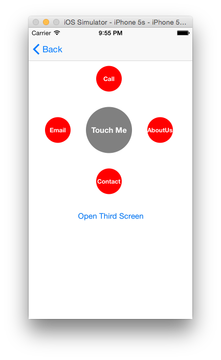

# PJAssitiveTouch
Assistive touch button - No standard API or feature available for developers to play with assistive touch in iOS SDK. If some one wants to create it for the application, all they have to spend time on designing and coding such component from scratch. Instead of doing this from scratch, programmers can use this “PJAssitiveTouch” control as starting point or base for their requirement. You can customize it as per requirement. This control will help programmers to create base which can be used to show one/multiple buttons on top of all components on screen in any orientation.  Once added on view controller, will be maintained throughout the application.

# Adding PJAssitiveTouch to your project
PJAssitiveTouch is developed using objective c means .h/.m files. Programmers can directly drag-drop those PJAssistiveTouch.h/.m classes in project. Don’t forget to check “copy items to your project”.  Once added, import this class as “#import PJAssitiveTouch.h”

# How to use
Its very simple to show Assistive touch in your application. Whenever you want it to be displayed from any view controller, say, firstViewController, add below line …
```
[PJAssistiveTouch addAssistiveTouch];
```
in respective view controller initial point like viewDidLoad / viewWillAppear etc and it will be displayed until programmer explicitly hides it.

# Images




# License
This code is distributed under the terms and conditions of the MIT license.
